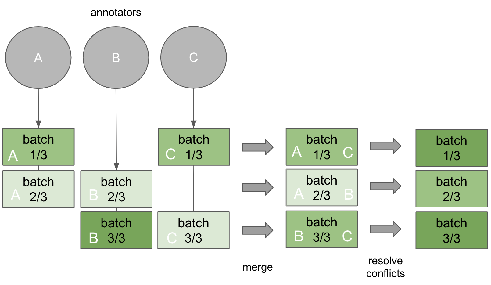

# x-annotate

x-annotate (pronounced "cross-annotate") is a project management tool for cross-annotation with popular annotation frameworks.

## Installation

`pip install .`

## About

x-annotate provides a simple command line interface that lets you

- split data between annotators
- merge annotations and resolve conflicts

## Supported Tools & Use Cases

| Annotation Tool | Token Classification | Text Classification |
|-----------------|----------------------|---------------------|
| Doccano         | :white_check_mark:   | :x:                 |
| Label Studio    | :x:                  | :x:                 |

## Setup

### Configuration files

You need to create two essential files that contain all necessary specifications:

- `.config.ini`:

      [main]
      tool = doccano
      url = http://localhost:8082

      [admin]
      username = admin
      password = password

  Under `[main]`, the annotation `tool` and the `url` it is running at are specified.
  `[admin]` contains the username and password for the administrator, 
  who is in charge of the annotation tool administration and uses x-annotate to manage the annotation workflow.  

- `.project.ini`:

      [data]
      name = <name>
      file = <path_to_file>

      [metadata]
      guidelines = <path_to_guidelines>
      labels = <path_to_labels>

      [master]
      username = admin

      [annotators]
      username = user1,user2

    Under `[data]` and `[metadata]`, paths to the (raw) data, guidelines and labels are specified.
    The `[annotators]` get assigned individual annotation tasks, whereas the `[master]` annotator leads the
    session to resolve conflicts (note that above, master annotator = admin).

### Data

In addition, you should create the files specified in the `.project.ini` file:

- data as a dictionary in jsonl format like this: `{"doc_id": "1", "text": "This is an example.", "tags": []}`

- annotation guidelines in markdown format

- labels as a dictionary in json format like this: `{<label_name>: <label_color>}`

    The `<label_color>` can be the name of a color (see `xannotate/utils/colors.py` for options) or any color specified as a hex color code, e.g. #ff0000)

Examples of the above files are given in the `examples` folder.

## Usage

The Command Line Interface (CLI) uses the following syntax:

    xannotate COMMAND

The 4 basic available COMMANDs are

| COMMAND    | Step | To be used                    | Description                                                 |
|------------|------|-------------------------------|-------------------------------------------------------------|
| **assign** | 1    | in the beginning              | split the data and assign it to the annotators              |
| **merge**  | 2    | after individual annotations  | merge the different annotations                             |
| **finish** | 3    | after resolution of conflicts | download the final annotations                              |
| **status** | -    | anytime                       | check the data and annotation status in the annotation tool |

It is possible to specify different config and project files than the default 
files `.config.ini` and `.project.ini`, 
by using the optional arguments `-c` and `-p`

    xannotate [-c CONFIG_FILE] [-p PROJECT_FILE] COMMAND

## Example

An example annotation workflow is demonstrated in the `example` folder. See `example/README.md`.

## Citation

    @misc{x-annotate,
      author = {Stollenwerk, Felix},
      title  = {x-annotate: a project management tool for cross-annotation with popular annotation frameworks.},
      year   = {2023},
      url    = {https://github.com/flxst/x-annotate},
    }
