# Example

In this example, we will annotate a single document using the 
x-annotate workflow. The annotations aim at token classification (NER) and will be done by 3 people using Doccano.

First, we will go through the setup. Afterwards, we will simulate the annotation workflow.

## 1. Setup

### Configuration files

We will use the configuration files `.config.ini` and `.project.ini` from the main folder. 
In particular, this means that we have the following users & roles:

- user = `admin`, role = admin & master annotator 
- user = `user1`, role = annotator
- user = `user2`, role = annotator

**Make sure that you are running a Doccano instance at the url specified in the `.config.ini` file.
Then, register the above users in Doccano.**

### Data
Take a look at the following files:

- `example_data.jsonl`

  This file contains the raw text data in jsonl format. It is only a single sentence.

- `example_guidelines.json`

  This file contains the annotation guidelines in markdown format. 

- `example_labels.json`

  This file contains the labels and their associated colors in json format. 

## 2. Annotation Workflow

We can now start the annotation workflow. The shown commands are to be executed in a terminal. 

##### A. check the status (optional)

  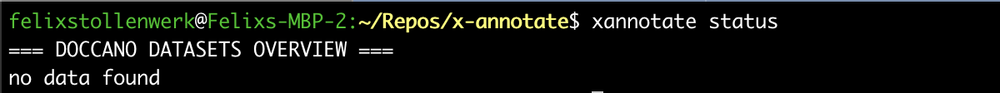
  
  There should be no data in Doccano yet.

##### B. assign the data to the annotators

  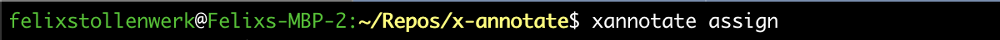

Note that the output messages were skipped above.  
  

##### C. check the status (optional)

  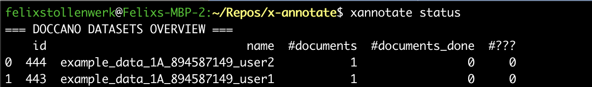

  We now see 2 projects with the single document replicated (`#documents = 1`). Each annotator (`user1` and `user2`) is assigned a project.
  No annotation work has been done so far (`#documents_done = 0`).

##### D. individual annotation

  `user1` logs in and annotates:

  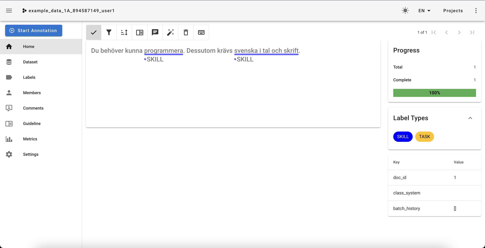

  `user2` logs in and annotates:

  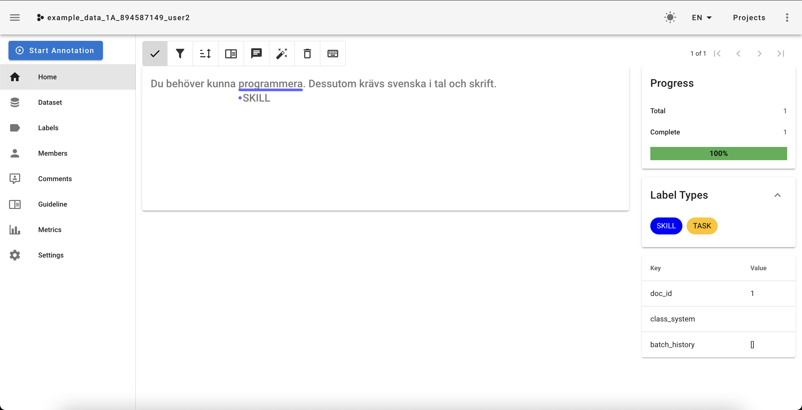

##### E. check the status (optional)

  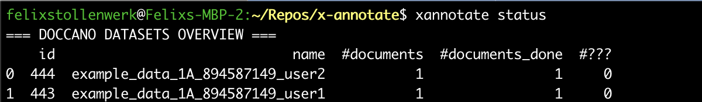

Note that we now have `#documents_done = 1`.

##### F. merge

  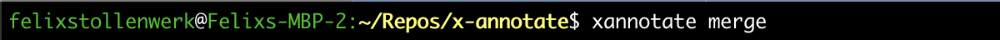

Note that the output messages were skipped above.  

##### G. check the status (optional)

  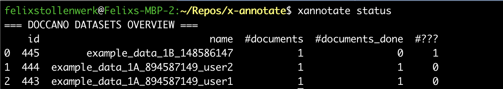

There is a new project assigned to the `master` annotator, with the annotation data from the individual annotations by `user1` and `user2` merged. 
Since there is a conflict between the annotations that needs to be resolved, 
we have `#??? = 1`.

##### H. resolve conflicts

  `admin` (in their role as the master annotator) logs in:

  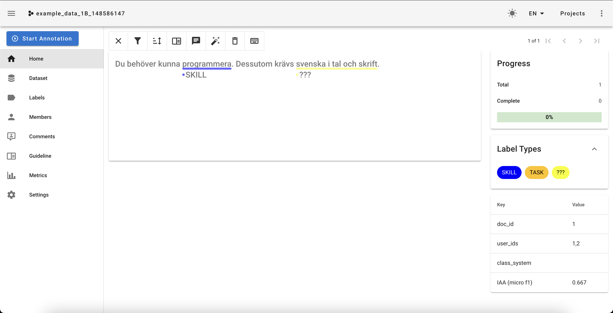

  All the annotators have a meeting and resolve conflicts (marked by `???`) together:

  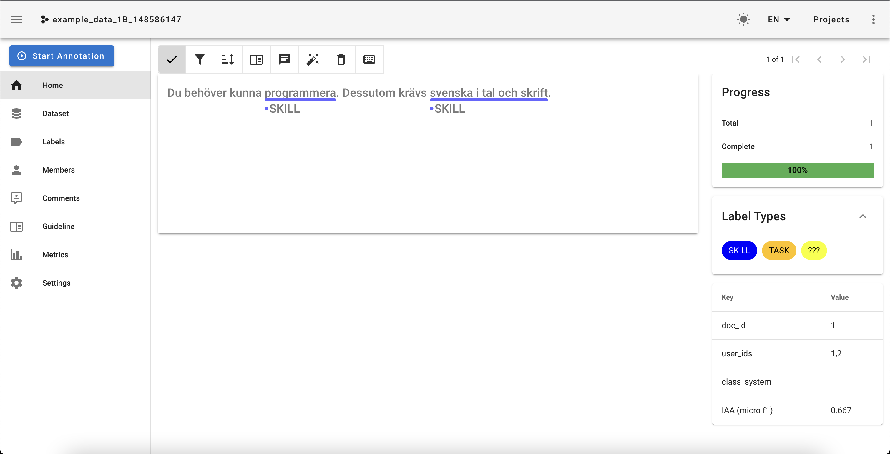

##### I. check the status (optional)

  

##### J. download the final annotations and finish

  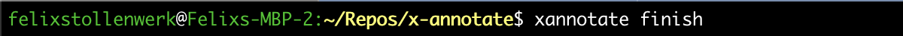

Note that the output messages were skipped above. There is now a file `example_data_ANNOTATED.jsonl` with the final annotations. We're done! 
